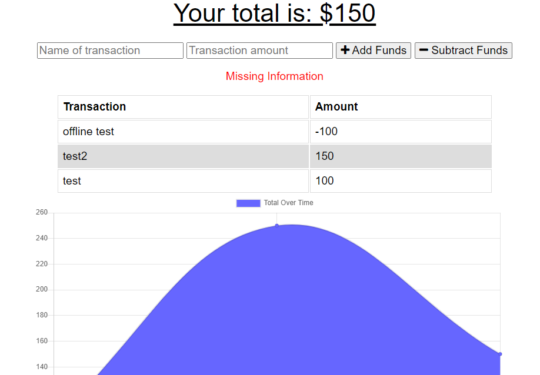

# Budget Tracker

## Description
This is a PWA that allows a user to track a budget over time. The user can add or subtract funds, with a graph displaying the total value over time. The user can also save their transactions offline, and they will be entered into the budget ledger when a connection is reestablished.

## Table of Contents        
- [Usage](#usage)           

- [Questions?](#questions)
           

## Usage
View the deployed app at the following [link](https://enigmatic-crag-90504.herokuapp.com/)!

When the page is loaded the view will see a screen similar to the one below, the total of the users budget is listed at the top of the screen. The user can enter a Name as well as a total for each transaction, before choosing if the amount of being added or subtracted. If either field is left blank when the Add or Subtract buttons are clicked, the error message "Missing Information" will display. This information will then be displayed on the chart at the bottom of the page, and will be updated for each transaction entered, to show the total over time. The user is also able to enter transactions while offline, which will be saved and updated once a connection is reestablished.

           
## Questions?

View more of my work at the Github link below or contact me at the email below.

Github: [alexander-camacho](https://github.com/alexander-camacho)

Email: alsbrain@optonline.net